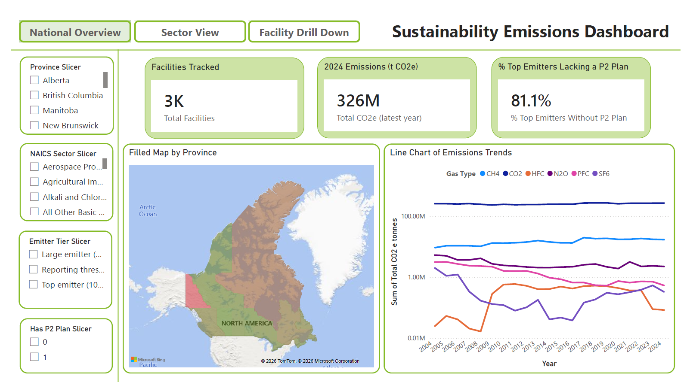
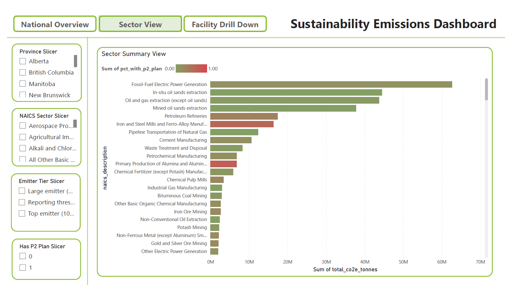
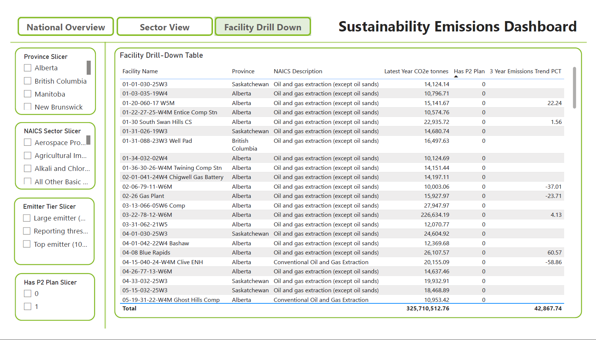

# Canadian Industrial Emissions & Pollution Prevention Analytics

Joins two real Government of Canada datasets — facility-level greenhouse
gas emissions and pollution prevention (P2) plan status — to answer one
question: which high-emitting facilities have no documented plan to do
anything about their emissions, and how does that break down by sector
and province?

Every number here traces back to a facility that actually reported
under CEPA 1999. The headline finding below was checked by hand against
the raw source files before being trusted.

## Dashboard

Sector View, colored by share of facilities with a P2 plan (the chart
the headline finding sits on) and the filterable Facility Drill-down:

 

## Stack

- **Databases**: Azure SQL Database, MongoDB
- **ETL**: Python (pandas, SQLAlchemy, PyMongo), Node.js (NPRI API client)
- **Orchestration**: Azure Data Factory — pipeline design in `adf/`, not deployed
- **Reporting**: Power BI (Power BI Project format, git-friendly), Power BI Report Server (paginated report)

## Data sources

**GHGRP (Greenhouse Gas Reporting Program) → Azure SQL**
Facilities emitting 10,000+ tonnes CO2e/year report annually to
Environment and Climate Change Canada. Two files: Emissions by Gas
(2004–present, facility × year × gas type) and Emissions by Source
(2022–present, facility × year × source category).

Download: https://open.canada.ca/data/en/dataset/a8ba14b7-7f23-462a-bdbb-83b0ef629823
— pull the .csv format for both files. Column headers shift slightly
year to year; check against `data_prep/config.py`.

**NPRI (National Pollutant Release Inventory) → MongoDB**
Per-facility P2 plan/activity flags (`hasP2Plan`, `hasP2Activity`),
fetched via `data_prep/fetch_npri.js` from NPRI's facility-search API.
There's no bulk CSV for this data. One document per facility-year.

Source: https://www.canada.ca/en/environment-climate-change/services/national-pollutant-release-inventory/tools-resources-data.html
→ "Explore National Pollutant Release Inventory Data"

## Pipeline

1. `data_prep/` — cleans and standardizes the raw CSVs. Facility
   identity is resolved by `ghgrp_id`; normalized-name matching is only
   a fallback for the NPRI join, where no ID crosswalk exists.
2. `sql/` — Azure SQL schema (`dim_facility`, `fact_emissions_by_gas`,
   `fact_emissions_by_source`, `fact_facility_enriched`) and reporting views.
3. `etl/load_to_sql.py`, `etl/load_to_mongo.py` — load the cleaned data.
4. `etl/reconcile_and_transform.py` — joins both sources, computes
   `has_p2_plan`, `has_p2_activity`, and each facility's 3-year emissions trend.
5. `adf/` — Azure Data Factory orchestration design.
6. `powerbi/` — dashboard, built as a `.pbip` Power BI Project for
   git-friendly diffs, with a bookmark-driven nav bar and synced slicers.
7. `reporting/` — paginated report (`.rdl`), deployed to a local Power
   BI Report Server; `TopEmittersP2Gap.xlsx` is an exported results snapshot.

Diagram: `diagrams/architecture.md`

## Finding

408 facilities reported 100,000+ tonnes CO2e in their most recent year.
331 of them (81.1%) have no NPRI-documented P2 plan. Excluding 40 top
emitters with no NPRI record at all under either ID crosswalk or name
match — mostly gas pipeline/transmission systems, a data gap rather
than a confirmed "no plan" — the figure is 291 of 368 (79.1%). The
second number is the one to quote without a footnote.

## Data quality issues found and fixed

- **Facility identity was fragmented by name.** Facilities get renamed
  across a 20-year reporting history — e.g. "Sundance Generating Plant"
  and "Sundance Thermal Electric Power Generating Plant" are the same
  Alberta plant, same `ghgrp_id`. Deduplicating by name instead of ID
  silently split 606 facilities (21% of the total) across multiple rows
  and broke the NPRI join for whichever name-variant lacked the ID
  crosswalk. Fixed by keying on `ghgrp_id` — dropped the "no NPRI match"
  rate among top emitters from 45.6% to 9.8%, and moved the headline
  number from an overstated 89.0% to a verified 81.1%.
- **NPRI's real data is two boolean flags, not an itemized activity
  list.** Found only after actually fetching it; the loader,
  reconciliation script, and schema were scaled back to match.
- **80 rows in the Emissions-by-Source file are empty placeholders** —
  no category, no quantity — dropped rather than left to violate the
  schema's `NOT NULL` constraint.
- **A single bad year can fake a trend.** Bridgewater Plant (NS)
  reported 67.8 tonnes CO2e in 2021 against a normal 15,000–27,000
  tonne range in every surrounding year — likely a shutdown or
  reporting gap — which reads as a +23,000% 3-year trend if taken at
  face value. `fact_facility_enriched.trend_baseline_flag` marks the 7
  facilities where this applies.
