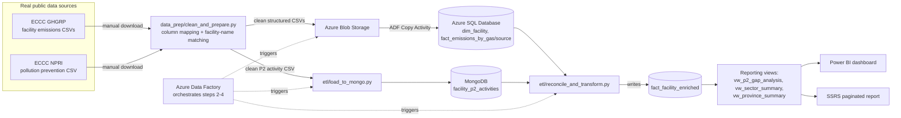

```mermaid
flowchart LR
    subgraph RealSources[Real public data sources]
        GHGRP[ECCC GHGRP<br/>facility emissions CSVs]
        NPRI[ECCC NPRI<br/>pollution prevention CSV]
    end

    GHGRP -->|manual download| Prep[data_prep/clean_and_prepare.py<br/>column mapping + facility-name matching]
    NPRI -->|manual download| Prep

    Prep -->|clean structured CSVs| Blob[Azure Blob Storage]
    Prep -->|clean P2 activity CSV| MongoLoad[etl/load_to_mongo.py]

    Blob -->|ADF Copy Activity| SQL[(Azure SQL Database<br/>dim_facility, fact_emissions_by_gas/source)]
    MongoLoad --> Mongo[(MongoDB<br/>facility_p2_activities)]

    SQL --> Reconcile[etl/reconcile_and_transform.py]
    Mongo --> Reconcile
    Reconcile -->|writes| Enriched[(fact_facility_enriched)]

    Enriched --> Views[Reporting views:<br/>vw_p2_gap_analysis, vw_sector_summary,<br/>vw_province_summary]
    Views --> PBI[Power BI dashboard]
    Views --> SSRS[SSRS paginated report]

    ADF[Azure Data Factory<br/>orchestrates steps 2-4] -.triggers.-> Blob
    ADF -.triggers.-> MongoLoad
    ADF -.triggers.-> Reconcile
```
